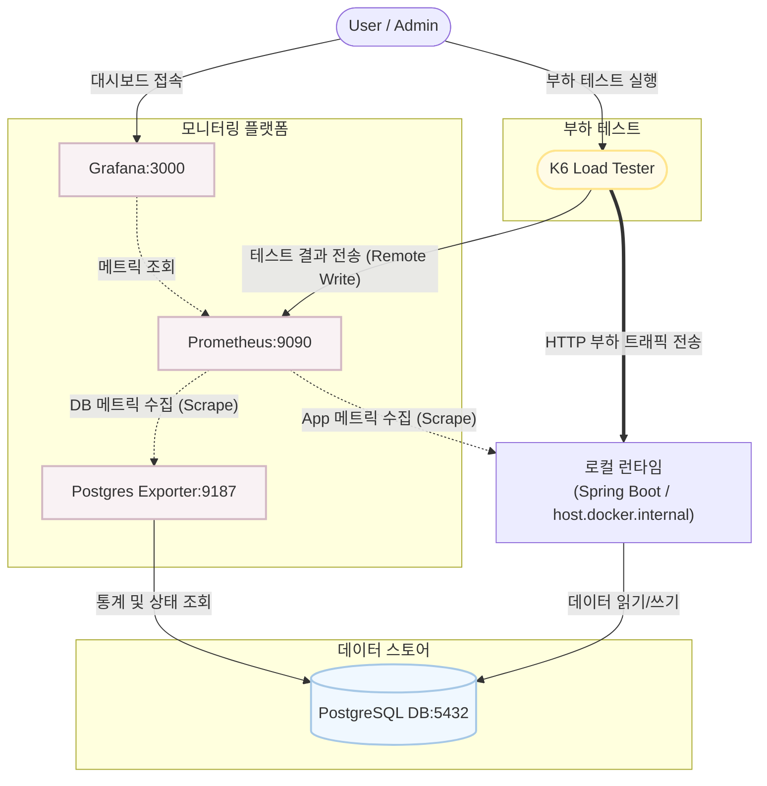

# Phase 3 구현 완료 요약 — DB Lock (비관적 락 + 낙관적 락)

## 목적

Phase 2에서 증명된 overselling(Lost Update) 문제를 **DB 레벨 락**으로 해결한다.
두 가지 전략(비관적 락, 낙관적 락)을 구현하고, 동일한 동시성 테스트로 정합성 보장을 검증한다.

---

## 구현 완료 파일 목록

| Step | 파일                                                             | 작업                                                                             | 상태 |
| ---- | ---------------------------------------------------------------- | -------------------------------------------------------------------------------- | ---- |
| 1    | `concurrency/build.gradle`                                       | `spring-retry` 제거, Spring Framework 7 네이티브 retry 사용 (별도 의존성 불필요) | ✅   |
| 2    | `concurrency/src/main/.../domain/Concert.java`                   | `@Version` 필드 추가 (낙관적 락), `decreaseStock()` 재고 부족 가드 추가          | ✅   |
| 3    | `postgres/init/02_schema.sql`                                    | concert 테이블에 `version BIGINT NOT NULL DEFAULT 0` 컬럼 추가                   | ✅   |
| 4    | `concurrency/src/main/.../repository/ConcertRepository.java`     | `findByIdWithPessimisticLock()` — `@Lock(PESSIMISTIC_WRITE)` 메서드 추가         | ✅   |
| 5    | `concurrency/src/main/.../service/ReservationService.java`       | `reserveWithPessimisticLock()`, `reserveWithOptimisticLock()` 메서드 추가        | ✅   |
| 5    | `concurrency/src/main/.../ConcurrencyApplication.java`           | `@EnableResilientMethods` 추가 (Spring Framework 7 네이티브 retry 활성화)        | ✅   |
| 6    | `concurrency/src/main/.../controller/ReservationController.java` | `POST /pessimistic`, `POST /optimistic` 엔드포인트 추가                          | ✅   |
| 7    | `concurrency/src/main/.../controller/TestController.java`        | 변경 없음 — `@Version`은 JPA가 자동 관리하므로 reset 로직 수정 불필요            | ✅   |
| 8    | `concurrency/src/test/.../PessimisticLockTest.java`              | API 단위 + 서비스 동시성 + API 동시성 테스트 (4개 테스트)                        | ✅   |
| 8    | `concurrency/src/test/.../OptimisticLockTest.java`               | API 단위 + 서비스 동시성 + API 동시성 테스트 (4개 테스트)                        | ✅   |
| 9    | `scripts/pessimistic-lock.js`                                    | k6 부하 테스트 — 100 VU, 10초, POST /api/reservations/pessimistic                | ✅   |
| 9    | `scripts/optimistic-lock.js`                                     | k6 부하 테스트 — 100 VU, 10초, POST /api/reservations/optimistic                 | ✅   |

---

## 프로젝트 구조 (Phase 3 완료 시점)

```
concurrency/src/main/java/com/example/concurrency/
├── ConcurrencyApplication.java          # @EnableResilientMethods 추가
├── controller/
│   ├── ReservationController.java       # POST /api/reservations (Phase 2)
│   │                                    # POST /api/reservations/pessimistic (Phase 3)
│   │                                    # POST /api/reservations/optimistic (Phase 3)
│   ├── ReservationRequest.java          # record DTO
│   └── TestController.java              # GET /api/test, POST /api/test/reset
├── domain/
│   ├── Concert.java                     # @Version 추가 (낙관적 락)
│   └── Reservation.java                 # Entity
├── repository/
│   ├── ConcertRepository.java           # findByIdWithPessimisticLock() 추가
│   └── ReservationRepository.java
└── service/
    └── ReservationService.java          # reserve() — Phase 2 베이스라인
                                         # reserveWithPessimisticLock() — Phase 3
                                         # reserveWithOptimisticLock() + @Retryable — Phase 3

concurrency/src/test/java/com/example/concurrency/
├── ReservationConcurrencyTest.java      # Phase 2 — 락 없는 overselling 증명
├── PessimisticLockTest.java             # Phase 3 — 비관적 락 테스트 (4개)
└── OptimisticLockTest.java              # Phase 3 — 낙관적 락 테스트 (4개)

scripts/
├── baseline.js                          # Phase 2 k6 부하 테스트
├── pessimistic-lock.js                  # Phase 3 비관적 락 k6 부하 테스트
└── optimistic-lock.js                   # Phase 3 낙관적 락 k6 부하 테스트
```

---

## 1. 핵심 구현 상세

### 1-1. 비관적 락 (Pessimistic Lock) — `SELECT ... FOR UPDATE`

#### 원리

조회 시점에 해당 행에 **배타적 락**을 건다.
다른 트랜잭션은 락이 해제될 때까지 **대기**한다.

```
시간  Thread A                              Thread B                              DB stock
────  ────────────────────────────────────  ────────────────────────────────────  ────────
t1    SELECT ... FOR UPDATE → stock=100     (대기 — 락 획득 불가)                  100
t2    stock-- → 99                          (대기)                                100
t3    COMMIT → UPDATE stock=99              (대기)                                99
t4    (락 해제)                              SELECT ... FOR UPDATE → stock=99      99
t5                                          stock-- → 98                          99
t6                                          COMMIT → UPDATE stock=98              98
```

→ 순차 처리되므로 Lost Update가 **절대 발생하지 않는다**.

#### ConcertRepository — 비관적 락 조회 메서드

```java
// 비관적 락 조회 — SELECT ... FOR UPDATE (다른 트랜잭션은 락 해제까지 대기)
@Lock(LockModeType.PESSIMISTIC_WRITE)
@Query("SELECT c FROM Concert c WHERE c.id = :id")
Optional<Concert> findByIdWithPessimisticLock(@Param("id") Long id);
```

- `@Lock(LockModeType.PESSIMISTIC_WRITE)` → JPA가 `SELECT c.id, c.title, c.stock, c.version FROM concert c WHERE c.id=? FOR UPDATE` SQL을 생성
- `FOR UPDATE` — 해당 행에 배타적 쓰기 락을 건다
- 트랜잭션이 커밋/롤백될 때 락이 자동 해제된다

#### ReservationService — 비관적 락 예약

```java
@Transactional
public void reserveWithPessimisticLock(Long concertId, Long userId) {
    // ① SELECT ... FOR UPDATE — 행 잠금
    Concert concert = concertRepository.findByIdWithPessimisticLock(concertId)
            .orElseThrow(() -> new IllegalArgumentException("Concert not found. id=" + concertId));

    // ② 재고 차감 (stock <= 0이면 IllegalStateException)
    concert.decreaseStock();

    // ③ 예약 저장
    reservationRepository.save(new Reservation(concertId, userId));
    // ④ 트랜잭션 커밋 → JPA Dirty Checking → UPDATE + 락 해제
}
```

### 1-2. 낙관적 락 (Optimistic Lock) — `@Version` + 재시도

#### 원리

`@Version`으로 버전 컬럼을 관리한다.
JPA가 UPDATE 시 `WHERE version = ?` 조건을 자동 추가하여, 다른 트랜잭션이 먼저 커밋했으면 version이 달라져 UPDATE 0행 변경 → `ObjectOptimisticLockingFailureException` 발생 → **재시도**한다.

```
시간  Thread A                              Thread B                              DB (stock, version)
────  ────────────────────────────────────  ────────────────────────────────────  ──────────────────
t1    SELECT → stock=100, version=0         SELECT → stock=100, version=0         (100, 0)
t2    stock-- → 99                          stock-- → 99                          (100, 0)
t3    UPDATE ... WHERE version=0 → 1행 성공                                       (99, 1)
t4                                          UPDATE ... WHERE version=0 → 0행!     (99, 1)
t5                                          OptimisticLockException 발생!
t6                                          ↳ @Retryable → 재시도
t7                                          SELECT → stock=99, version=1          (99, 1)
t8                                          stock-- → 98
t9                                          UPDATE ... WHERE version=1 → 성공     (98, 2)
```

→ 충돌이 감지되면 예외가 발생하고, 재시도로 최신 데이터를 다시 읽어 처리한다.

#### Concert Entity — @Version 필드 추가

```java
// 낙관적 락용 버전 컬럼 — UPDATE 시 version 불일치면 OptimisticLockException 발생
@Version
private Long version;
```

- JPA가 UPDATE 쿼리 생성 시 자동으로 `UPDATE concert SET stock=?, version=version+1 WHERE id=? AND version=?` 형태로 변환
- 별도 코드 없이 엔티티에 `@Version`만 선언하면 동작
- version 값은 JPA가 자동 관리 — 개발자가 직접 조작하지 않음

#### Concert Entity — decreaseStock() 재고 부족 가드 추가

```java
// Phase 2: this.stock-- (가드 없음 → 음수 가능)
// Phase 3: 재고 부족 시 예외 발생
public void decreaseStock() {
    if (this.stock <= 0) {
        throw new IllegalStateException("Sold out.");
    }
    this.stock--;
}
```

Phase 2에서는 `stock--`만 있어 음수까지 내려갔지만, Phase 3에서는 `stock <= 0` 체크로 매진 시 예외를 던진다.
Controller에서 이 예외를 잡아 409 응답으로 변환한다.

#### ReservationService — 낙관적 락 예약 + @Retryable

```java
@Retryable(
        includes = ObjectOptimisticLockingFailureException.class,
        maxRetries = 4,   // 최대 4회 재시도 (총 5회 시도)
        delay = 100       // 재시도 간격 100ms
)
@Transactional
public void reserveWithOptimisticLock(Long concertId, Long userId) {
    // 일반 조회 — @Version으로 커밋 시점에 충돌 감지
    Concert concert = concertRepository.findById(concertId)
            .orElseThrow(() -> new IllegalArgumentException("Concert not found. id=" + concertId));

    concert.decreaseStock();
    reservationRepository.save(new Reservation(concertId, userId));
}
```

#### ConcurrencyApplication — @EnableResilientMethods 추가

```java
@SpringBootApplication
@EnableResilientMethods  // @Retryable 활성화 — 낙관적 락 재시도용
public class ConcurrencyApplication { ... }
```

> **Spring Boot 4.x / Spring Framework 7 변경사항 (트러블슈팅)**
>
> Spring Boot 3.x에서 사용하던 `spring-retry` 라이브러리는 Spring Boot 4.x에서 더 이상 의존성 관리가 되지 않는다.
> Spring Framework 7부터 retry 기능이 네이티브로 내장되어 별도 의존성이 필요 없다.
>
> | 항목        | Spring Boot 3.x (Old)                  | Spring Boot 4.x (New)                       |
> | ----------- | -------------------------------------- | ------------------------------------------- |
> | 의존성      | `spring-retry` + `spring-aspects` 필요 | **불필요** (spring-context에 내장)          |
> | 패키지      | `org.springframework.retry.annotation` | `org.springframework.resilience.annotation` |
> | 활성화      | `@EnableRetry`                         | `@EnableResilientMethods`                   |
> | 재시도 횟수 | `maxAttempts = 5` (총 시도 횟수)       | `maxRetries = 4` (재시도 횟수, 총 5회 시도) |
> | 지연        | `backoff = @Backoff(delay = 100)`      | `delay = 100`                               |
> | 예외 지정   | `retryFor = {Exception.class}`         | `includes = {Exception.class}`              |

### 1-3. API 엔드포인트 — ReservationController

```java
// 락 없는 예약 (Phase 2 베이스라인)
@PostMapping
public ResponseEntity<Map<String, String>> reserve(...) { ... }

// 비관적 락 예약 (Phase 3)
@PostMapping("/pessimistic")
public ResponseEntity<Map<String, String>> reserveWithPessimisticLock(...) { ... }

// 낙관적 락 예약 (Phase 3)
@PostMapping("/optimistic")
public ResponseEntity<Map<String, String>> reserveWithOptimisticLock(...) { ... }
```

| Method | Endpoint                        | 락 방식                       | Phase |
| ------ | ------------------------------- | ----------------------------- | ----- |
| POST   | `/api/reservations`             | 없음 (베이스라인)             | 2     |
| POST   | `/api/reservations/pessimistic` | 비관적 락 (SELECT FOR UPDATE) | 3     |
| POST   | `/api/reservations/optimistic`  | 낙관적 락 (@Version + Retry)  | 3     |

모든 엔드포인트의 응답:

- **200 OK**: `{"status": "reserved"}` — 예약 성공
- **409 CONFLICT**: `{"status": "sold_out"}` — 매진

### 1-4. DB 스키마 변경 — 02_schema.sql

```sql
CREATE TABLE IF NOT EXISTS concert (
    id      BIGSERIAL PRIMARY KEY,
    title   VARCHAR(255) NOT NULL,
    stock   INT NOT NULL DEFAULT 100,
    version BIGINT NOT NULL DEFAULT 0       -- Phase 3에서 추가 (낙관적 락용)
);
```

- `version` 컬럼: 낙관적 락을 위해 추가. JPA `@Version`이 이 컬럼을 자동 관리한다.
- 비관적 락은 별도 컬럼 없이 `SELECT ... FOR UPDATE` SQL만으로 동작한다.

### 1-5. TestController — 변경 없음

`@Version` 필드는 JPA가 자동 관리하므로 `POST /api/test/reset`에서 version을 수동 리셋할 필요가 없다.
`concert.setStock(100)` → `save()` 시 JPA가 알아서 `version = version + 1`을 실행한다.

---

## 2. 단위 테스트 — 동시성 정합성 검증

### 2-1. 테스트 파일 구조

각 락 방식당 **4개의 테스트**를 작성했다:

| #   | 테스트                       | 목적                                       | 검증 내용                   |
| --- | ---------------------------- | ------------------------------------------ | --------------------------- |
| 1   | API 단위 — 200 OK            | 단일 예약이 정상 동작하는지                | 응답 200, 재고 99           |
| 2   | API 단위 — 409 Sold Out      | 재고 0일 때 거부하는지                     | 응답 409                    |
| 3   | Service 동시성 (100 threads) | Service 레이어에서 정합성 보장되는지       | `성공 수 + 남은 재고 = 100` |
| 4   | API 동시성 (100 threads)     | HTTP 레이어까지 포함하여 정합성 보장되는지 | `성공 수 + 남은 재고 = 100` |

### 2-2. 테스트 실행 방법

```bash
# 사전 조건: Docker Desktop이 실행 중이어야 한다 (Testcontainers가 Docker로 PostgreSQL을 띄우므로)

# 프로젝트 루트에서 실행
cd concurrency

# 비관적 락 테스트만 실행
./gradlew clean test --tests "com.example.concurrency.PessimisticLockTest" --info

# 낙관적 락 테스트만 실행
./gradlew clean test --tests "com.example.concurrency.OptimisticLockTest" --info

# Phase 3 전체 테스트 실행
./gradlew clean test --tests "com.example.concurrency.PessimisticLockTest" \
                     --tests "com.example.concurrency.OptimisticLockTest" --info

# Phase 2 + Phase 3 전체 테스트 실행
./gradlew clean test --info
```

> `--info` 옵션을 붙이면 `System.out.println` 출력을 터미널에서 직접 확인할 수 있다.

### 2-3. 테스트 환경

- **Testcontainers**: 테스트 실행 시 Docker로 `postgres:17-alpine` 컨테이너를 자동으로 띄움
- **@ServiceConnection**: 컨테이너의 랜덤 포트를 Spring의 datasource에 자동 연결 (application.yml 오버라이드)
- **@SpringBootTest(RANDOM_PORT)**: 실제 서블릿 컨테이너를 띄워 HTTP 엔드포인트 테스트 가능
- **TestRestTemplate**: 실제 HTTP 요청을 보내는 테스트 클라이언트

> **Spring Boot 4.x 변경사항**: `TestRestTemplate`의 패키지가 `org.springframework.boot.test.web.client` → `org.springframework.boot.resttestclient`로 변경되었다.

> **Testcontainers 2.x 변경사항**: `PostgreSQLContainer<?>`에서 제네릭(`<?>`)이 제거되어 `PostgreSQLContainer`로 사용한다.

### 2-4. 테스트 코드 동작 흐름

테스트는 크게 **환경 준비 → 동시 실행 → 결과 검증** 3단계로 구성된다.

#### Phase A: 환경 준비 (Testcontainers + @BeforeEach)

```
1. @Testcontainers + @Container
   → JUnit이 테스트 시작 전에 Docker로 PostgreSQL 17-alpine 컨테이너를 자동으로 띄움
   → 테스트 종료 후 컨테이너 자동 삭제

2. @ServiceConnection
   → 띄워진 PostgreSQL 컨테이너의 랜덤 포트를 Spring의 datasource에 자동 연결
   → application.yml의 DB 설정을 오버라이드 (별도 설정 불필요)

3. @BeforeEach setUp()
   → reservationRepository.deleteAll()  : 이전 테스트 데이터 정리
   → concert가 없으면 생성, 있으면 stock=100으로 리셋
   → 매 테스트마다 동일한 초기 상태 보장
```

#### Phase B: 동시 실행 (100 threads, CountDownLatch)

```
1. ExecutorService executor = Executors.newFixedThreadPool(100)
   → 100개의 스레드를 가진 스레드 풀 생성

2. CountDownLatch latch = new CountDownLatch(100)
   → 100개의 스레드가 모두 완료될 때까지 메인 스레드가 대기하기 위한 장치

3. for (i = 0; i < 100; i++)
   └─ executor.submit(() -> {
        reservationService.reserveWithPessimisticLock(1L, userId);  // 또는 optimistic
        successCount.incrementAndGet();
        latch.countDown();
      })
   → 100개의 스레드가 거의 동시에 예약 시도

4. latch.await()
   → 100개의 스레드가 모두 끝날 때까지 메인 스레드 대기
```

#### Phase C: 결과 검증

```java
Concert concert = concertRepository.findById(1L).orElseThrow();  // DB에서 최신 재고 조회
long reservationCount = reservationRepository.countByConcertId(1L);  // 실제 예약 건수

// 핵심 정합성 공식: 성공 수 + 남은 재고 = 초기 재고(100)
assertThat(concert.getStock()).isGreaterThanOrEqualTo(0);
assertThat(successCount.get() + concert.getStock()).isEqualTo(100);
assertThat(reservationCount).isEqualTo(successCount.get());
```

### 2-5. 기대 결과

#### 비관적 락 (PessimisticLockTest)

```
[Pessimistic Lock - Service] Success: 100, Fail: 0, Stock: 0, Reservations: 100
[Pessimistic Lock - API]     Success: 100, Fail: 0, Stock: 0, Reservations: 100
```

- 100개 스레드 **모두 성공** (순차적으로 락을 획득하여 처리)
- 실패 0건 — 락 대기 후 반드시 처리됨
- 재고 정확히 0, 예약 정확히 100건
- `successCount(100) + stock(0) = 100` ✅

#### 낙관적 락 (OptimisticLockTest)

```
[Optimistic Lock - Service] Success: 100, Fail(retry exhausted): 0, Stock: 0, Reservations: 100
```

또는 재시도 초과 발생 시:

```
[Optimistic Lock - Service] Success: 97, Fail(retry exhausted): 3, Stock: 3, Reservations: 97
```

- 대부분 성공하지만, 동시 충돌이 심하면 일부 스레드가 재시도 5회를 모두 소진하여 실패 가능
- 실패한 만큼 재고가 남음 → **정합성은 여전히 보장됨**
- `successCount(97) + stock(3) = 100` ✅

### 2-6. Phase 2 vs Phase 3 테스트 결과 비교

| 항목                | Phase 2 (락 없음) | Phase 3 비관적 락 | Phase 3 낙관적 락 |
| ------------------- | ----------------- | ----------------- | ----------------- |
| 성공 수             | 100               | 100               | 97~100            |
| 실패 수             | 0                 | 0                 | 0~3 (retry 초과)  |
| 남은 재고           | 87~91             | 0                 | 0~3               |
| 예약 건수           | 100               | 100               | 97~100            |
| 정합성              | **깨짐** ❌       | **보장** ✅       | **보장** ✅       |
| `예약 + 재고 = 100` | ❌ (109~113)      | ✅ (100)          | ✅ (100)          |

---

## 3. k6 부하 테스트 — HTTP 레벨 성능 비교

### 3-1. 사전 준비

```bash
# 1. Docker Compose로 인프라 실행 (PostgreSQL, Prometheus, Grafana 등)
docker compose up -d

# 2. Spring Boot 앱 로컬 실행
cd concurrency
./gradlew bootRun

# 3. 서버 정상 동작 확인
curl http://localhost:8080/api/test
# → {"message":"Load test API is working!"}

# 4. DB 초기 데이터 확인
curl -X POST http://localhost:8080/api/test/reset
# → {"status":"reset","stock":"100"}
```

### 3-2. k6 부하 테스트 실행

```bash
# 프로젝트 루트 디렉토리에서 실행

# 1. 베이스라인 (Phase 2 — 락 없음)
docker compose --profile test run --rm k6 run \
  --out experimental-prometheus-rw /scripts/baseline.js

# 2. 비관적 락 (Phase 3)
docker compose --profile test run --rm k6 run \
  --out experimental-prometheus-rw /scripts/pessimistic-lock.js

# 3. 낙관적 락 (Phase 3)
docker compose --profile test run --rm k6 run \
  --out experimental-prometheus-rw /scripts/optimistic-lock.js
```

> 각 테스트 스크립트의 `setup()` 함수가 테스트 시작 전에 자동으로 `POST /api/test/reset`을 호출하여 DB를 초기화한다.

### 3-3. k6 스크립트 설정

| 항목                | baseline.js         | pessimistic-lock.js             | optimistic-lock.js             |
| ------------------- | ------------------- | ------------------------------- | ------------------------------ |
| VU 수               | 100                 | 100                             | 100                            |
| 지속시간            | 10s                 | 10s                             | 10s                            |
| 엔드포인트          | `/api/reservations` | `/api/reservations/pessimistic` | `/api/reservations/optimistic` |
| 에러율 임계값       | < 1%                | < 1%                            | < 5% (재시도 초과 허용)        |
| p95 응답시간 임계값 | < 1000ms            | < 3000ms (락 대기 여유)         | < 3000ms                       |

#### pessimistic-lock.js 동작 흐름

```
1. setup() — POST /api/test/reset → DB 초기화 (stock=100, 예약 전부 삭제)

2. default function (100 VU × 10초간 반복)
   → 각 VU가 POST /api/reservations/pessimistic { concertId: 1, userId: __VU } 를 반복 호출
   → 첫 100건은 200(reserved), 이후는 409(sold_out) 응답

3. check() — 200 또는 409인지 확인
```

#### optimistic-lock.js 동작 흐름

```
1. setup() — POST /api/test/reset → DB 초기화

2. default function (100 VU × 10초간 반복)
   → 각 VU가 POST /api/reservations/optimistic 을 반복 호출
   → 충돌 시 서버 내부에서 최대 5회 재시도
   → 재시도 초과 시 500 에러 가능 (thresholds에서 5% 이내 허용)

3. check() — 200 또는 409인지 확인
```

### 3-4. 테스트 결과 확인 방법

#### 방법 1: k6 터미널 출력

k6 실행이 끝나면 터미널에 아래와 같은 요약이 출력된다:

```
     checks.........................: XX.XX% ✓ XXXX   ✗ XXXX
     http_req_duration..............: avg=XXms  min=XXms  med=XXms  max=XXXms  p(90)=XXms  p(95)=XXms
     http_req_failed................: XX.XX%  ✓ XXXX   ✗ XXXX
     http_reqs......................: XXXX    XXX.XX/s (RPS)
     vus............................: 100     min=100  max=100
```

#### 방법 2: PostgreSQL에서 직접 정합성 확인

```bash
# Docker 내부의 PostgreSQL에 접속
docker exec -it postgres psql -U user -d reservation
```

```sql
-- 정합성 확인 쿼리
SELECT
    (SELECT COUNT(*) FROM reservation WHERE concert_id = 1) AS reservation_count,
    (SELECT 100 - stock FROM concert WHERE id = 1)           AS stock_deducted,
    (SELECT COUNT(*) FROM reservation WHERE concert_id = 1)
        - (SELECT 100 - stock FROM concert WHERE id = 1)    AS inconsistency;

-- Phase 2 (baseline): inconsistency = 수천 → overselling 발생
-- Phase 3 (pessimistic/optimistic): inconsistency = 0 → 정합성 보장
```

#### 방법 3: Grafana 대시보드에서 시각화

```
1. 브라우저에서 http://localhost:3000 접속
2. 로그인: admin / admin
3. 좌측 메뉴 → Dashboards → 기존 대시보드 선택 또는 새로 생성
```

Prometheus에서 수집 가능한 주요 지표:

| Prometheus 쿼리                                | 의미                             |
| ---------------------------------------------- | -------------------------------- |
| `rate(http_server_requests_seconds_count[1m])` | Spring 서버의 초당 요청 처리량   |
| `http_server_requests_seconds_bucket`          | 응답시간 분포 (히스토그램)       |
| `hikaricp_connections_active`                  | DB 커넥션 풀 사용 중인 커넥션 수 |
| `hikaricp_connections_pending`                 | DB 커넥션 대기 중인 요청 수      |
| `k6_http_req_duration_p95`                     | k6에서 측정한 p95 응답시간       |
| `k6_http_reqs_total`                           | k6에서 측정한 총 요청 수         |

### 3-5. Phase 별 k6 테스트 기대 결과 비교

| 지표         | Phase 2 (락 없음)         | Phase 3 비관적 락       | Phase 3 낙관적 락                |
| ------------ | ------------------------- | ----------------------- | -------------------------------- |
| RPS          | **높음** (락 없어서 빠름) | **낮음** (락 대기 발생) | **중간** (충돌 시 재시도)        |
| p95 응답시간 | **낮음**                  | **높음** (락 대기)      | **중간** (재시도 시 +100ms)      |
| 에러율       | **낮음** (모두 성공)      | **낮음** (대기 후 성공) | **약간 높음** (재시도 초과 가능) |
| 정합성       | **깨짐** ❌               | **보장** ✅             | **보장** ✅                      |

**핵심 인사이트**: Phase 2는 빠르지만 데이터가 틀리고, Phase 3은 느려지지만 데이터가 정확하다.
"빠르지만 데이터가 틀린" 시스템은 의미가 없다.

---

## 4. 비관적 락 vs 낙관적 락 — 특성 비교

| 비교 항목   | 비관적 락                          | 낙관적 락                               |
| ----------- | ---------------------------------- | --------------------------------------- |
| 락 시점     | **읽기 시점** (SELECT FOR UPDATE)  | **쓰기 시점** (UPDATE 시 version 비교)  |
| 충돌 처리   | 대기 (다른 트랜잭션이 끝날 때까지) | 재시도 (version 불일치 시 예외 → retry) |
| 동시성      | 낮음 (직렬화)                      | 높음 (충돌 없으면 병렬 처리)            |
| 적합한 상황 | 충돌이 **자주** 발생하는 경우      | 충돌이 **드문** 경우                    |
| 데드락 위험 | 있음 (여러 리소스 동시 락 시)      | 없음                                    |
| DB 부하     | 락 관리 오버헤드                   | 재시도 시 추가 쿼리 발생                |
| 재고 0 도달 | 반드시 0 (모든 요청이 순차 처리)   | 0 이상 (재시도 초과로 일부 실패 가능)   |

---

## 다음 단계 (선택)

- **Step 10**: 데드락 시나리오 테스트 — 비관적 락에서 여러 리소스를 역순으로 잠글 때 데드락 발생 확인
- **Step 11-14**: HikariCP 커넥션 풀 튜닝 실험 — 풀 크기 조정에 따른 성능 변화 관찰
- **Phase 4**: Redis 분산 락 (Redisson) — DB 락의 한계를 넘어 분산 환경에서의 동시성 제어

### 🏗️ 인프라 아키텍처


