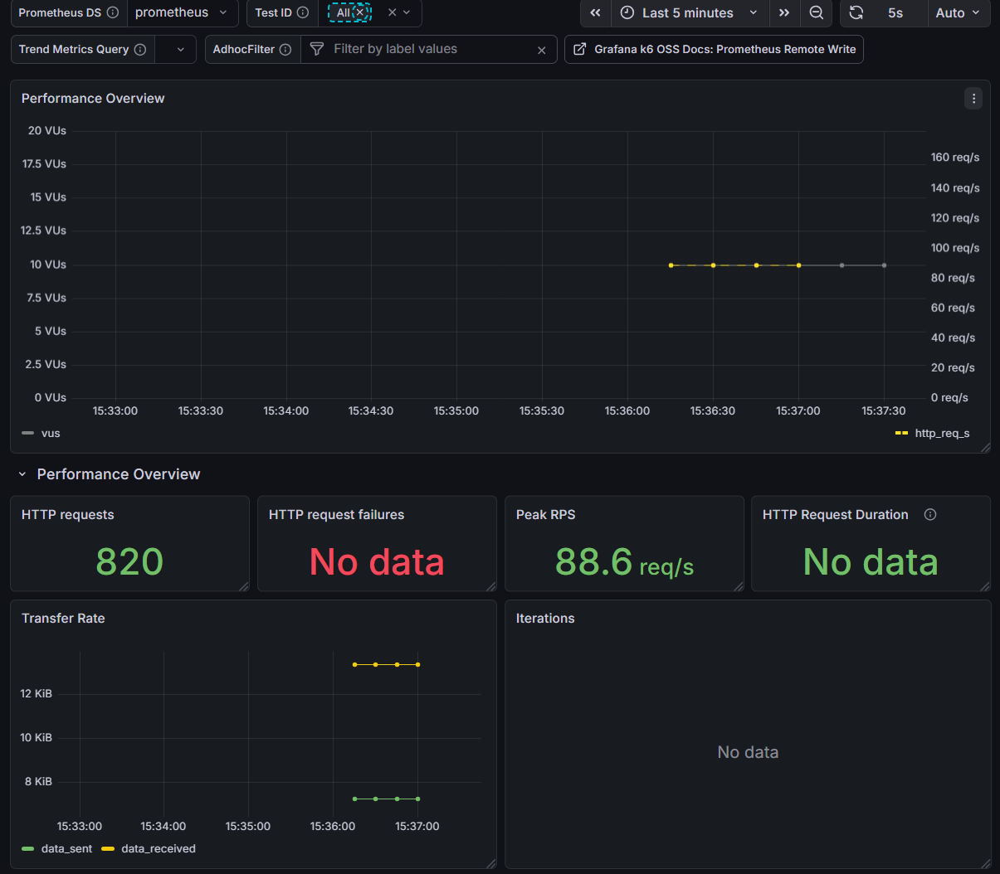

# Spring Boot Monitoring Setup Summary

이 문서는 지금까지 진행한 Spring Boot ↔ Prometheus ↔ Grafana 연동 및 모니터링 구축 작업의 핵심 내용을 정리한 것입니다. 추후 학습 후 다시 작업을 이어나가실 때 참고하시기 바랍니다.

## 1. 현재까지 완료된 작업 (진행 상황)

### ① Spring Boot 설정 (`application.yml` 및 `build.gradle`)

- **의존성 추가**: `spring-boot-starter-actuator`, `micrometer-registry-prometheus` 의존성을 통해 Spring Boot 앱이 JVM 및 애플리케이션 메트릭을 수집하도록 설정했습니다.
- **엔드포인트 노출**: `application.yml`에서 Actuator의 `prometheus` 엔드포인트를 노출시켰습니다.
- **메트릭 태그 추가**: 메트릭을 분류하기 쉽도록 `application: concurrency` 태그를 전역으로 추가했습니다.
  - 이를 통해 `http://localhost:8080/actuator/prometheus`로 접속하면 수집된 메트릭 데이터를 확인할 수 있습니다.

### ② Prometheus 설정 (`docker-compose.yml` & `prometheus.yml`)

- **Docker Compose**: Prometheus 컨테이너를 도커로 띄우고, 로컬 설정 파일(`prometheus.yml`)을 마운트하여 구동했습니다.
- **Scrape Config**: `prometheus.yml`에서 로컬 호스트의 Spring Boot 앱(포트 8080)을 `host.docker.internal:8080`을 통해 주기적(5초/10초 등)으로 긁어오도록(Scrape) 설정했습니다.

### ③ Grafana 로컬 연동 및 대시보드 불러오기

- **Grafana 실행**: Docker Compose를 통해 Grafana(포트 3000)를 구동했습니다.
- **Data Source 연동**: Grafana 내에서 Prometheus를 Data Source로 추가하고 연결 테스트를 완료했습니다.
- **JVM Micrometer 대시보드 임포트**: Spring Boot 기본 모니터링을 위해 기존에 만들어진 템플릿(JVM Micrometer dashboard)을 불러왔습니다.

### ④ Grafana Dashboard 환경변수(Variable) 트러블슈팅

- **문제 현상**: 대시보드를 임포트한 직후 매번 'Query Options'에서 수동으로 Refresh를 해야만 그래프가 나타나는 현상.
- **원인 및 해결 방향**:
  1. Grafana 변수(`$application`, `$instance`)가 Prometheus의 실제 메트릭 데이터와 매핑되지 않거나,
  2. 대시보드 로드 시 자동 갱신(`Refresh on dashboard load`) 설정이 안 되어 있거나,
  3. 현재 선택된 정상 상태 값을 **"대시보드 기본값(Default)"**으로 저장하지 않아서 발생합니다.
- **조치 사항**: Settings -> Variables 항목에서 각 변수의 Query를 `label_values(...)` 형태로 바로잡고, 정상 작동하는 상태에서 `Save current variable values as dashboard default`에 꼭 체크한 후 대시보드를 덮어써서 문제를 해결할 수 있습니다.

### ⑤ k6 부하 테스트 구축 및 Prometheus Remote Write 연동

- **k6 동작 구조 및 동기적 요청**: k6는 스크립트(`simple_test.js`)에 정의된 `vus`(Virtual Users) 수만큼 가상의 사용자를 생성하여, 각각 독립적으로 동시에 API 엔드포인트에 요청을 보냅니다. 한 명의 VU는 요청을 보내고 (동기적으로) 응답을 받을 때까지 기다린 후, 응답을 확인(`check`)하고 다시 다음 요청을 반복 수행하는 **동기(Synchronous) 루프** 형태를 가집니다. 이를 `duration` 시간 동안 무한히 반복하여 부하를 창출합니다.
- **Docker Compose 실행 및 종료 (`Exited (0)`)**: `docker compose --profile test up k6` 명령어로 테스트가 실행되면 k6 컨테이너가 생성됩니다. 테스트(`duration: '10s'`)가 모두 끝나면, 더 이상 실행할 프로세스가 없으므로 컨테이너 자체가 정상적으로 임무를 완수하고 **`STATUS: Exited (0)`** 상태로 자동 종료됩니다. 이는 에러(비정상 종료)가 아닌 성공적인 스크립트 실행 완료를 의미합니다!
- **Remote Write 연동 확인**: k6는 다른 앱들처럼 Prometheus가 긁어가는(Pull) 방식이 아니라, 테스트 도중 발생한 메트릭들을 직접 Prometheus의 특정 URL(`http://prometheus:9090/api/v1/write`)로 실시간 푸시(Push; Remote Write)하는 방식을 채택합니다.
- **Grafana 대시보드 추가**: Prometheus 서버가 전송받은 부하 지표를 시각화하기 위해 공식 k6 대시보드(**ID: 19665**)를 Data Source(Prometheus)로 성공적으로 불러왔습니다.

  
  _그라파나에서 실시간으로 수집되는 k6 부하 테스트 지표 현황_

  | docker compose --profile 로 실행한 이미지는 종료하기 위해서는 다음 명령어 이용 `docker compose --profile test down`

### ⑥ k6 부하 테스트 로그 해석 가이드

> k6 컨테이너 실행 직후 터미널에 출력되는 최종 로그 텍스트를 분석하는 방법입니다.

```text
k6  |   █ THRESHOLDS
k6  |     http_req_failed
k6  |     ✓ 'rate<0.01' rate=0.00%
```

- **THRESHOLDS (성공 임계치)**: 스크립트 옵션에 걸어둔 `http_req_failed` 에러율(< 1%) 통과 여부를 보여줍니다. 실패율이 0%가 나왔으므로 통과(✓)했습니다.

```text
k6  |     checks_total.......: 820     81.11252/s
k6  |     checks_succeeded...: 100.00% 820 out of 820
```

- **checks (검증 로직)**: 응답 `status is 200`을 검사하는 `check(res, ...)` 로직이 총 **820번** 수행되었고, 모든 응답(100%)이 HTTP 200 OK를 반환했습니다.

```text
k6  |     http_req_duration..............: avg=22.03ms  min=12.88ms  med=19.69ms  max=135.1ms  p(90)=27.11ms  p(95)=27.89ms
k6  |     http_reqs......................: 820    81.11252/s
```

- **http_req_duration (요청 소요 시간)**: 가장 중요한 지표입니다. 요청-응답의 전체 평균(avg)은 22.03ms이며, 최솟값(min) 12.88ms, 중앙값(med) 19.69ms, 최댓값(max) 135.1ms를 기록했습니다.
- 특히 **p(95)=27.89ms**는 하위 95%의 요청이 약 28ms 미만으로 처리가 완료되었음을 뜻합니다.
- **http_reqs (총 요청 수 / 초당 요청 수)**: 테스트가 진행된 10초 동안 총 **820개의 요청(http_reqs)**이 발생했으며 이는 **초당 약 81회(TPS: 81.1/s)** 수준의 부하입니다.

```text
k6  |     iteration_duration.............: avg=122.99ms min=113.61ms med=120.32ms max=252.62ms p(90)=127.64ms p(95)=128.82ms
k6  |     iterations.....................: 820    81.11252/s
k6  |     vus............................: 10     min=10       max=10
k6  |     vus_max........................: 10     min=10       max=10
```

- **iteration_duration**: 한 명의 가상 사용자가 "초기화 → API 요청 → 대기(sleep 0.1) → 반복" 한 바퀴를 도는 데 걸린 평균 시간입니다. 우리가 `sleep(0.1)` (100ms)을 걸어두었기 때문에 API 응답 시점(22ms)과 합하여 얼추 122ms가 평균 사이클이 되었습니다.
- **vus (가상 사용자)**: 우리가 지정한 대로 총 10 명의 가상 사용자(최소~최대)가 할당되어 활동했음을 보여줍니다.

---

## 2. 향후 진행할 다음 단계 (Next Steps)

프로메테우스와 그라파나의 기본 작동 방식 및 PromQL, 대시보드 변수(Variable) 시스템에 익숙해지신 후, 다음 단계로 넘어갈 수 있습니다.

1. **대시보드 커스터마이징 및 고도화**
   - 현재 임포트한 대시보드 외에, 내 애플리케이션(예: 예약 시스템)에 특화된 커스텀 메트릭 표시
   - 알람(Alerting) 기능 설정 (서버 다운, CPU 초과 등)

2. **k6 성능 테스트 지표 연동**
   - 추후 Docker로 k6 성능 테스트 환경 구축
   - k6의 테스트 결과를 Prometheus를 통해 수집하고 Grafana에서 시각화하여 TPS, 응답 지연(Latency) 등을 분석

---

**💡 학습 조언**:

- **Prometheus**: 메트릭이 수집되는 포맷(Key-Value 형태)과 데이터를 조회하는 쿼리 언어인 **PromQL**의 기본 형태를 학습해 보세요.
- **Grafana**: **Variables** (변수) 시스템과 대시보드 **패널(Panel) 편집** 방식을 한번 훑어보시면, 템플릿을 수정하거나 새로 그릴 때 큰 도움이 됩니다.
