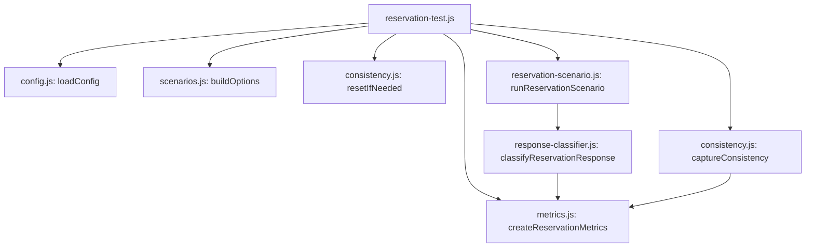

# k6 JS Module Separation Design

## 배경

현재 k6 부하 테스트의 핵심 entrypoint는 `k6/reservation-test.js`이다. 이 파일은 하나의 k6 script 안에서 다음 책임을 모두 처리한다.

- preset JSON 로딩과 환경변수 해석
- `phase`, `scenario`, `preset`, `pool` label 검증
- k6 executor와 scenario option 생성
- custom Counter/Gauge metric 선언
- setup 단계의 테스트 데이터 reset
- Reservation 요청 payload 생성과 HTTP 호출
- status code 기반 응답 분류
- teardown 단계의 consistency snapshot 조회와 Gauge 기록
- sleep, threshold, summary trend stats 설정

초기 Phase 2 baseline에서는 이 구조가 단순했지만, Phase 3 DB 전략 비교와 Phase 4 운영 한계 실험이 추가되면서 파일을 읽는 비용이 커졌다. Phase 6 Idempotency에서는 요청 header, idempotency key 생성 규칙, 중복 요청 분류, body status 기반 classification이 필요해질 가능성이 높다. 지금 구조에 조건문을 계속 추가하면 실험 의도와 k6 runtime plumbing이 한 파일 안에서 더 강하게 섞인다.

이 프로젝트에서 k6는 애플리케이션 성능 자체보다 phase별 결론을 뒷받침하는 evidence 생성 도구에 가깝다. 따라서 k6 코드는 phase별 실험 의도를 읽기 쉽게 드러내고, metric과 evidence label 계약을 안정적으로 유지해야 한다.

## 목표

- `k6/reservation-test.js`를 k6 lifecycle orchestration 파일로 축소한다.
- 환경설정, scenario option 생성, metric 정의, 부하 실행 로직, 응답 분류, consistency metric 기록을 별도 JS 모듈로 분리한다.
- 기존 `k6/presets/*.json` 포맷을 유지한다.
- 기존 `k6/run.sh`, Makefile target, Docker Compose k6 실행 방식을 유지한다.
- 기존 Prometheus/Grafana label 계약인 `phase`, `scenario`, `preset`, `pool`을 유지한다.
- 기존 Phase 2, Phase 3, Phase 4 preset이 동일한 동작을 하도록 한다.
- Phase 6 Idempotency에서 request/header/response classification 확장이 가능하도록 경계를 만든다.

## 비목표

- 이번 단계에서 `k6/presets/*.json`을 YAML로 전환하지 않는다.
- 이번 단계에서 `k6/run.sh`를 Node 기반 runner로 교체하지 않는다.
- 이번 단계에서 부하 조건, threshold, duration, VU 수를 변경하지 않는다.
- 이번 단계에서 Grafana dashboard query나 panel을 변경하지 않는다.
- 이번 단계에서 새로운 Phase 6 부하 시나리오를 구현하지 않는다.
- 이번 단계에서 k6 script를 phase별로 여러 개 만들지 않는다.

## 결정

1단계 리팩토링은 JS 모듈 관심사 분리로 제한한다.

`k6/reservation-test.js`는 k6가 직접 호출하는 entrypoint로 유지하되, 실제 구현 세부사항은 `k6/lib/*.js`로 이동한다. k6 runtime은 Node.js가 아니므로 외부 npm 패키지나 Node 전용 API에 의존하지 않는다. k6에서 지원하는 ES module import와 k6 built-in module만 사용한다.

Preset source of truth는 계속 `k6/presets/*.json`이다. YAML 전환은 후속 작업으로 남기며, 이 spec의 결과물이 안정화된 뒤 별도 spec에서 다룬다.

## 파일 구조

```text
k6/
  reservation-test.js
  run.sh

  presets/
    baseline.json
    phase3-pessimistic-baseline.json
    phase3-optimistic-baseline.json
    phase3-atomic-baseline.json
    phase4-atomic-pool.json
    phase4-pessimistic-pool.json
    phase4-pessimistic-timeout.json
    ramp-up.json
    spike.json
    sustained.json

  lib/
    config.js
    scenarios.js
    metrics.js
    reservation-scenario.js
    response-classifier.js
    consistency.js
```

`run.sh`와 `presets/`는 이번 단계에서 구조를 바꾸지 않는다. 새로 추가되는 것은 `k6/lib/` 모듈이다.

## Entrypoint 책임

`k6/reservation-test.js`는 다음 책임만 가진다.

- `loadConfig()` 호출
- `createReservationMetrics()` 호출
- `buildOptions(config)` 결과를 `export const options`로 노출
- `setup()`에서 reset과 metric 초기화 호출
- `teardown()`에서 consistency capture 호출
- `default()`에서 reservation scenario 실행 호출

예상 형태는 다음과 같다.

```js
const config = loadConfig();
const metrics = createReservationMetrics();

export const options = buildOptions(config);

export function setup() {
  initializeMetrics(metrics);
  resetIfNeeded(config);
}

export function teardown() {
  captureConsistency(config, metrics);
}

export default function () {
  runReservationScenario(config, metrics);
}
```

이 파일은 k6 lifecycle 흐름을 한눈에 보여주는 목적으로 유지한다. 세부 로직을 추가할 때 이 파일이 다시 커지면 모듈 경계가 깨진 것으로 본다.

## Config Module

`k6/lib/config.js`는 preset과 환경변수를 읽어 실행 설정 객체를 만든다.

책임은 다음과 같다.

- `__ENV.PRESET` 기본값을 `presets/baseline.json`으로 처리한다.
- `open(presetPath)`로 JSON preset을 읽고 parse한다.
- `BASE_URL`, `POOL` 환경변수 override를 반영한다.
- `phase`, `scenario`, `preset`, `pool` 필수 string 값을 검증한다.
- `path`, `expectedStatuses`, `sleepSeconds`, `resetBeforeRun`, `captureConsistency` 기본값을 정리한다.
- k6 option tag에 들어갈 값을 `config.tags`로 제공한다.

`requiredString()` 같은 검증 helper는 이 모듈 안에 둔다. 다른 모듈은 preset 원본을 직접 검증하지 않고, 정규화된 `config` 객체만 사용한다.

## Scenarios Module

`k6/lib/scenarios.js`는 k6 `options` 생성을 담당한다.

책임은 다음과 같다.

- `constant-vus` executor option 생성
- `ramping-vus` executor option 생성
- 지원하지 않는 executor에 대한 명확한 error 발생
- `tags`, `thresholds`, `summaryTrendStats` 포함

기존 `summaryTrendStats` 값은 유지한다.

```js
["avg", "min", "med", "max", "p(90)", "p(95)", "p(99)"]
```

새 executor가 필요하면 이 모듈에만 추가한다. Reservation 요청 로직이나 metric 모듈은 executor 종류를 알 필요가 없다.

## Metrics Module

`k6/lib/metrics.js`는 custom metric 선언과 초기화를 담당한다.

기존 metric 이름은 유지한다.

- `reservation_reserved`
- `reservation_sold_out`
- `reservation_lock_timeout`
- `reservation_unexpected_status`
- `concert_reservation_count`
- `concert_remaining_seats`
- `concert_seat_count_inconsistency`
- `concert_overbooked`

모듈은 다음 API를 제공한다.

```js
export function createReservationMetrics()
export function initializeMetrics(metrics)
```

`createReservationMetrics()`는 Counter/Gauge 인스턴스를 반환한다. `initializeMetrics()`는 Counter를 0으로 seed 한다. Gauge는 teardown snapshot이 있을 때만 기록한다.

Phase 6에서 `reservation_duplicate_replayed`, `reservation_idempotency_conflict` 같은 metric이 필요해지면 이 모듈에서 metric 이름을 추가하고, response classifier가 해당 metric key를 반환하도록 확장한다.

## Reservation Scenario Module

`k6/lib/reservation-scenario.js`는 VU 1회 실행 로직을 담당한다.

책임은 다음과 같다.

- Reservation endpoint URL 구성
- request body 생성
- HTTP POST 실행
- k6 `check()`로 expected status 검증
- response classifier 호출
- classification 결과에 따라 metric 증가
- `sleepSeconds`가 있으면 sleep 실행

초기 request body는 기존과 동일하게 유지한다.

```json
{
  "concertId": 1,
  "userId": "__VU"
}
```

`concertId`는 preset의 `concertId`가 있으면 사용하고, 없으면 `1`을 사용한다. `userId`는 기존처럼 `__VU`를 사용한다.

이 모듈은 Phase 6 확장 지점이다. 이후 idempotency key가 필요하면 request builder를 별도 함수로 추출하거나, `config.request` 형태의 정규화된 설정을 받아 header/body 생성 규칙을 확장한다. 단, 이번 단계에서는 기존 payload와 header 계약을 변경하지 않는다.

## Response Classifier Module

`k6/lib/response-classifier.js`는 HTTP 응답을 custom metric 분류로 바꾼다.

초기 분류 규칙은 기존 status code 기반 규칙을 그대로 유지한다.

| HTTP status | classification |
|---|---|
| `200` | `reserved` |
| `409` | `soldOut` |
| `408` | `lockTimeout` |
| 그 외 | `unexpected` |

모듈은 다음 API를 제공한다.

```js
export function createExpectedStatusCallback(expectedStatuses)
export function classifyReservationResponse(response)
export function recordReservationClassification(metrics, classification)
```

`createExpectedStatusCallback()`은 `http.expectedStatuses(...expectedStatuses)`를 감싼다. expected status 계약이 preset 기반이라는 점을 이 모듈에 모은다.

Phase 3 문서에는 `409 {"status":"optimistic_lock_exhausted"}`를 구분하는 관측 항목이 언급되어 있다. 현재 코드의 실제 metric은 모든 409를 `reservation_sold_out`으로 센다. 이번 리팩토링은 기존 동작을 바꾸지 않지만, body status 기반 분류가 필요해질 때 이 모듈에서 확장한다.

## Consistency Module

`k6/lib/consistency.js`는 setup reset과 teardown consistency snapshot 처리를 담당한다.

책임은 다음과 같다.

- `resetBeforeRun === false`이면 reset을 건너뛴다.
- `POST /api/test/reset` 결과를 `check()`로 검증한다.
- `captureConsistency === false`이면 teardown snapshot을 건너뛴다.
- `GET /api/test/consistency` 결과를 `check()`로 검증한다.
- JSON parse 실패, object 형태 오류, numeric field 누락, boolean field 누락을 명확히 로그로 남긴다.
- snapshot 값을 Gauge metric에 기록한다.

기존 validation 규칙은 유지한다.

- `reservationCount`는 finite number여야 한다.
- `remainingSeats`는 finite number여야 한다.
- `seatCountInconsistency`는 finite number여야 한다.
- `overbooked`는 boolean이어야 한다.

이 모듈은 Reservation scenario와 독립적이어야 한다. 실제 부하 요청이 어떻게 생겼는지 몰라도 consistency snapshot만 처리할 수 있어야 한다.

## Data Flow

전체 흐름은 다음과 같다.



`reservation-test.js`는 orchestration만 담당한다. 각 모듈은 k6 lifecycle 함수의 내부 단계로 호출된다.

## 기존 호환성

다음 항목은 변경하지 않는다.

- `bash k6/run.sh baseline prometheus`
- `make k6-run PRESET=baseline MODE=prometheus`
- `make k6-evidence ...`
- `docker compose --profile test run --rm k6 ...`
- `__ENV.PRESET`
- `__ENV.BASE_URL`
- `__ENV.POOL`
- k6 summary JSON 출력 위치
- k6 terminal log 출력 위치
- Grafana run-window JSON 생성 방식
- Prometheus remote write metric label

이 리팩토링 후에도 기존 evidence pipeline은 같은 명령으로 실행되어야 한다.

## 테스트 전략

k6 script는 k6 runtime에서 실행되므로 일반 Node unit test로 모든 모듈을 직접 실행하기 어렵다. 따라서 1단계 검증은 다음 조합으로 한다.

1. 정적 검증 스크립트
   - 기존 `scripts/verify-k6-reservation-responses.js`를 새 모듈 구조에 맞게 갱신한다.
   - expected status callback이 preset 기반인지 확인한다.
   - p99 summary trend stats가 유지되는지 확인한다.
   - 기존 custom counter 이름이 유지되는지 확인한다.
   - hard-coded `http.expectedStatuses(200, 409)`가 재도입되지 않았는지 확인한다.

2. k6 dry-level 검증
   - `make k6-verify`가 통과해야 한다.
   - 가능하면 `bash k6/run.sh baseline local` 또는 `bash k6/run.sh baseline prometheus`로 실제 k6 실행을 확인한다.

3. evidence 호환 검증
   - summary JSON이 기존 경로에 생성되는지 확인한다.
   - run-window JSON이 기존 경로와 schema로 생성되는지 확인한다.
   - Grafana dashboard variable이 기존 label로 데이터를 조회할 수 있는지 확인한다.

이번 단계에서 새로운 성능 수치를 기대하지 않는다. 성공 기준은 동작 동일성과 코드 구조 개선이다.

## 마이그레이션 전략

1. 현재 `reservation-test.js`의 동작을 기준선으로 삼는다.
2. `config.js`를 추가하고 preset/env 로딩과 필수값 검증을 이동한다.
3. `scenarios.js`를 추가하고 `options` 생성 로직을 이동한다.
4. `metrics.js`를 추가하고 Counter/Gauge 선언과 초기화를 이동한다.
5. `response-classifier.js`를 추가하고 expected status callback과 status 분류를 이동한다.
6. `consistency.js`를 추가하고 setup reset과 teardown snapshot 처리를 이동한다.
7. `reservation-scenario.js`를 추가하고 default VU 실행 로직을 이동한다.
8. `reservation-test.js`를 orchestration 코드로 축소한다.
9. `scripts/verify-k6-reservation-responses.js`를 새 구조에 맞게 갱신한다.
10. `make k6-verify`와 가능한 k6 실행 명령으로 검증한다.

각 단계는 기존 preset 파일과 run script를 건드리지 않는 방식으로 진행한다.

## 후속 YAML 전환과의 관계

이 spec은 YAML 전환의 선행 작업이다.

이번 단계에서 `config.js`가 preset을 정규화하면, 후속 단계에서 `k6/profiles/*.yml`을 도입하더라도 나머지 모듈은 크게 바뀌지 않는다. YAML 전환 시에는 Node generator가 사람이 관리하는 YAML profile을 k6가 읽을 JSON preset으로 생성하는 방식을 우선 검토한다.

예상 후속 구조는 다음과 같다.

```text
k6/
  profiles/
    phase2-baseline.yml
    phase3-db-strategies.yml
    phase4-operational-limits.yml
    phase6-idempotency.yml

  presets/
    generated-json-files.json
```

이 후속 작업은 별도 spec에서 다룬다.

## 기대 효과

- `reservation-test.js`만 읽어도 k6 lifecycle 흐름을 빠르게 파악할 수 있다.
- metric 정의와 response classification이 분리되어 새로운 custom metric 추가 지점이 명확해진다.
- Phase 6 Idempotency의 header/key/body-status 분류 확장을 `reservation-scenario.js`와 `response-classifier.js` 중심으로 수용할 수 있다.
- 기존 Phase 2, Phase 3, Phase 4 evidence pipeline을 깨지 않고 코드 가독성을 개선한다.
- 이후 YAML profile 전환 시 preset parsing 경계가 이미 분리되어 migration 위험이 줄어든다.

## 승인 기준

- `k6/reservation-test.js`는 lifecycle orchestration만 담당한다.
- `k6/lib/*.js` 모듈이 책임별로 분리되어 있다.
- 기존 preset JSON 파일은 유지된다.
- 기존 k6 실행 명령이 유지된다.
- 기존 custom metric 이름이 유지된다.
- 기존 Prometheus/Grafana label 계약이 유지된다.
- `make k6-verify`가 통과한다.
- 가능한 환경에서는 실제 k6 baseline 실행이 성공한다.
